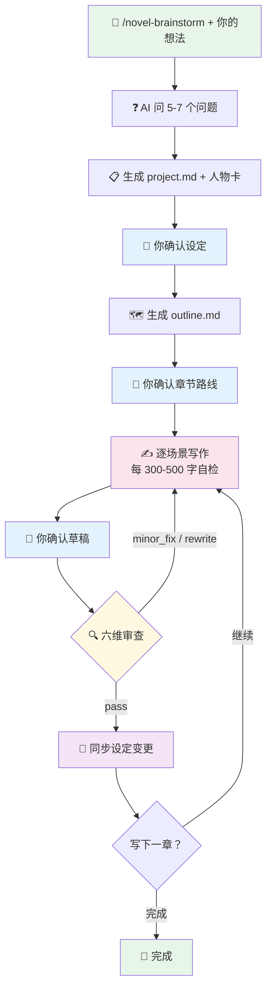
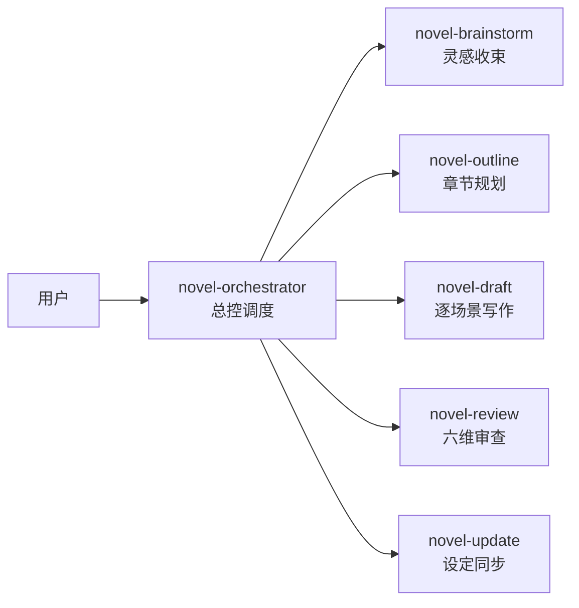

<div align="center">


# Novel Flow / 小说流

[](https://trae.ai)
[](LICENSE)
[](#架构)
[](#写作风格)

**AI 辅助长篇小说写作系统**

6 个协作 Skill，从灵感到定稿全流程覆盖。
去 AI 味 · 风格引擎 · 结构化审查 · 防漂移机制

[快速开始](#快速开始) · [使用流程](#使用流程) · [目录结构](#目录结构)

</div>

---

## ✨ 特性

- **去 AI 味引擎** — 50+ 禁用词表 + 句式/段落/对话/叙事去 AI 化规则，每 300-500 字自动自检
- **风格规则系统** — 3 种内置风格（冷白描 / 系统爽文 / 怪诞悬疑）
- **结构化审查** — 三层闸门 + 六维量化审查，2 项不通过即重写
- **防漂移机制** — HARD-GATE 强制每章读取 6 个上下文文件，不允许偷懒跳步
- **双层状态模型** — status + stage 独立追踪，文件契约统一定义格式

## 快速开始

```bash
# 1. 下载仓库
git clone https://github.com/your-username/novel-flow.git

# 2. 复制到你的 Trae 项目
cp -r novel-flow/skills  your-project/.trae/
cp -r novel-flow/shared  your-project/.trae/
```

## 也可以直接告诉AI：
```
安装这个 skill：https://github.com/ZhangDongyang800/novel-flow-one-by-one-.git
```

## 使用流程



> 🟢 绿色 = AI 自动执行 · 🔵 蓝色 = 需要你确认 · 🟡🩷 黄粉 = 审查与修正

## 架构



## 写作风格

|     风格     | 适合类型                           | 核心特征                       |
| :----------: | ---------------------------------- | ------------------------------ |
|  **冷白描**  | 现实主义、历史、悬疑、战争         | 克制、情感内敛       |
| **系统爽文** | 系统流、升级流、都市逆袭、玄幻修仙 | 憋屈→反转→爽、打脸升级         |
| **怪诞悬疑** | 规则怪谈、无限流、克苏鲁、智斗     | 规则设计、信息不对称、认知入侵 |

## 目录结构

```
novel-flow/
├── skills/
│   ├── novel-orchestrator/   # 总控调度
│   ├── novel-brainstorm/     # 灵感收束
│   │   └── templates/        # project.md · 人物卡.md
│   ├── novel-outline/        # 章节规划
│   │   └── templates/        # outline.md
│   ├── novel-draft/          # 逐场景写作
│   │   ├── templates/        # guide.md · chapter-xxx.md
│   │   └── styles/           # 冷白描 · 系统爽文 · 怪诞悬疑
│   ├── novel-review/         # 六维审查
│   └── novel-update/         # 设定同步
└── shared/
    ├── file-contracts.md     # 文件契约（数据字典）
    └── state-rules.md        # 状态流转规则
```

## License

[MIT](LICENSE)
