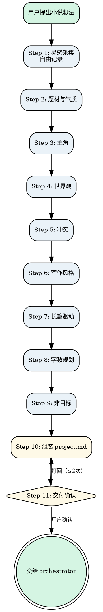

# Novel Brainstorm

把散乱灵感收敛成一个能直接开工的 `project.md` 和 `人物/` 文件夹。不写大纲、不写正文、不造设定集——只做一件事：**把模糊想法压实到足够清晰**。

核心方法论：**渐进收束**。从碎片出发，每轮只聚焦一个维度、只问一个问题，逐步把题材、主角、世界观、冲突、风格、驱动机制、字数、非目标八个维度压实，最终组装 `project.md`。

<HARD-GATE>
Do NOT invoke novel-outline, novel-draft, or any other novel skill until project.md has been written AND the user has approved it. This applies regardless of how clear the idea seems — a half-baked project.md will poison every downstream skill.

**Every turn MUST contain exactly one question with 2-4 options, then STOP and wait for the user's answer.** Do NOT ask multiple questions in a single turn. Do NOT combine multiple dimensions into one question. Do NOT say "让我确认一下剩余的问题" and then list several questions at once. One question. Wait for answer. Then next question.
</HARD-GATE>

## Anti-Pattern: "This Idea Is Clear Enough To Skip Brainstorm"

Every novel project goes through this process. Even if the user says "I already know exactly what I want", you still need to extract and confirm the core premise, characters, world rules, conflict, and writing constraints into project.md. The brainstorm can be fast (3-4 rounds of questions) if the user's idea is well-formed, but it MUST produce a complete project.md and get user approval before proceeding.

---

## Checklist

You MUST complete these items in order:

1. **Collect raw fragments** — record everything the user says, no judgment
2. **Genre & atmosphere** — lock down story type and mood (with options)
3. **Protagonist** — lock down who, what they want, what they fear, name (with options)
4. **World** — lock down world type and core rules (with options)
5. **Conflict** — lock down core tension and escalation logic (with options)
6. **Writing style** — lock down text style (with options)
7. **Long-form driver** — lock down what keeps readers reading (with options)
8. **Word count** — lock down total and per-chapter targets (with options)
9. **Non-goals** — lock down what NOT to write (with options)
10. **Assemble project.md** — fill every field, trace each to user-confirmed content
11. **Deliver & confirm** — show project.md, get user approval, hand off to orchestrator

---

## Process Flow



**The terminal state is invoking novel-orchestrator.** Do NOT invoke novel-outline, novel-draft, or any other novel skill. The ONLY skill you invoke after brainstorm is novel-orchestrator.

---

## The Process

### Step 1: 灵感采集

**目标：** 把用户脑子里所有碎片倒出来，不做评判，只做记录。

- 邀请用户自由描述想法——任何形式都行：一段话、几个关键词、一个画面、一种情绪
- 原样记录，不做收束或总结
- 如果用户提供了参考作品、情绪板等，一并记录
- **不要在这个阶段做任何收束或总结**——只记录

**验证点：** 有实质内容被记录。

---

### Step 2: 题材与气质

**目标：** 锁定"这到底是什么类型的故事"。

- 基于碎片，提出**一个**关于题材的问题，**附带 2-4 个选项**
  - 示例："根据你描述的碎片，这个故事偏向哪个方向？"
    - A. 硬科幻（注重科学逻辑和技术细节）
    - B. 软科幻（科幻设定为背景，重在人文探讨）
    - C. 科幻奇幻混合
    - D. 其他（你来描述）
- 追问气质/氛围，**附带选项**
  - 示例："你希望读者读完是什么感觉？"
    - A. 紧张刺激（全程高能）
    - B. 温暖治愈
    - C. 细思极恐
    - D. 史诗壮阔
    - E. 其他
- 如有参考作品，追问"你喜欢那部作品的哪个方面"，给出 2-3 个选项

**验证点：** 题材大类和气质方向已确认。

---

### Step 3: 主角

**目标：** 锁定"谁在经历这个故事"。

- 提出关于主角的**一个**问题，**附带 2-4 个选项**
  - 示例："主角是什么样的人？"
    - A. 普通人被卷入非凡事件（成长型）
    - B. 身怀绝技但隐藏身份（反转型）
    - C. 天生处于权力/命运中心（宿命型）
    - D. 其他
- 追问核心驱动力，**附带选项**
  - 示例："ta 最想要什么？"
    - A. 证明自己/获得认可
    - B. 保护某个人或某种东西
    - C. 揭开某个真相
    - D. 逃离现状/获得自由
    - E. 其他
- 明确询问主角名字。如用户说"没想好"，给出 2-3 个建议名字供选择
- 询问是否已有配角想法。如没有，建议 1-2 个配角类型

**验证点：** 主角画像、驱动力、名字已确认。

---

### Step 4: 世界观

**目标：** 锁定"故事发生在什么样的世界里"。

- 提出关于世界观的**一个**问题，**附带 2-4 个选项**
  - 示例："故事发生在什么样的世界？"
    - A. 现实世界，隐藏着不为人知的另一面
    - B. 完全架空的异世界
    - C. 近未来地球，科技带来社会剧变
    - D. 历史架空
    - E. 其他
- 追问核心规则，**附带选项**
  - 示例："这个世界的核心规则是什么？"
    - A. 有明确的力量等级体系
    - B. 力量来自特殊血统或天赋
    - C. 没有超自然力量，核心是社会博弈
    - D. 其他
- 确认世界对主角的关系，**附带选项**

**验证点：** 世界类型、核心规则已确认。

---

### Step 5: 冲突

**目标：** 锁定"故事的核心张力是什么"。

- 提出关于冲突的**一个**问题，**附带 2-4 个选项**
  - 示例："最大的矛盾来自哪里？"
    - A. 人 vs 人（明确对手）
    - B. 人 vs 体制/社会
    - C. 人 vs 自我
    - D. 人 vs 未知/命运
    - E. 其他
- 追问冲突升级逻辑，**附带选项**
  - 示例："矛盾会怎么发展？"
    - A. 逐步升级
    - B. 隐忍积累，最终爆发
    - C. 波折不断，一环扣一环
    - D. 其他
- 确认冲突与主角驱动力的咬合，**附带选项**

**验证点：** 冲突类型、升级方向已确认。

---

### Step 6: 写作风格

**目标：** 锁定"文字应该是什么感觉"。

- 提出关于文风的**一个**问题，**附带 2-4 个选项**
  - 示例："你希望文字是什么风格？"
    - A. **冷白描**（余华/海明威式）——克制、短句、情感内敛，适合现实主义/悬疑/战争
    - B. **系统爽文**——快节奏、憋屈反转、升级打脸、系统面板，适合系统流/升级流/都市逆袭/玄幻修仙
    - C. **怪诞悬疑**（《十日终焉》《诡秘之主》式）——规则怪谈、信息不对称、推理反转、认知入侵，适合规则怪谈/无限流/克苏鲁/智斗/生存游戏
    - D. 其他（请描述你想要的风格）
- 如用户选"其他"，追问 1-2 个具体偏好（句式长短？情绪浓度？对话密度？）

**验证点：** 风格已确认，将写入 project.md 的「写作风格」字段。

---

### Step 7: 长篇驱动机制

**目标：** 确认"为什么能撑起长篇"。

- 提出关于长篇驱动机制的**一个**问题，**附带 2-4 个选项**
  - 示例："故事靠什么吸引读者一直读下去？"
    - A. 角色成长弧光
    - B. 事件链条（悬念和反转）
    - C. 世界观探索
    - D. 人物关系
    - E. 其他
- **问完这个问题后，STOP。等待用户回答。不要继续问其他问题。**

**验证点：** 驱动机制已确认。

---

### Step 8: 字数规划

**目标：** 确认"写多长"。

- 提出关于字数的**一个**问题，**附带 2-4 个选项**
  - 示例："全书大概写多长？"
    - A. 15-30 万字
    - B. 50-80 万字
    - C. 80-150 万字
    - D. 150 万字以上
    - E. 其他
- 每章字数默认 2300 字左右（写在 project.md 模板中），如需修改可直接编辑 project.md
- **问完这个问题后，STOP。等待用户回答。不要继续问其他问题。**

**验证点：** 字数规划已确认。

---

### Step 9: 非目标

**目标：** 确认"不打算写什么"。

- 提出关于非目标的**一个**问题，**附带 2-4 个选项（可多选）**
  - 示例："以下哪些内容你不想写？（可多选）"
    - A. 感情线/恋爱戏份
    - B. 详细战斗/动作场面
    - C. 政治权谋博弈
    - D. 大段世界观说明
    - E. 其他
- **问完这个问题后，STOP。等待用户回答。不要继续问其他问题。**

**验证点：** 非目标已确认。

---

### Step 10: 组装 project.md

**目标：** 将所有收束结果组装为 `project.md`。

**project.md 结构（严格遵循 `shared/file-contracts.md` 定义）：**

```markdown
# [书名]

## 核心 Premise
> 一句话：谁 + 在什么处境 + 必须做什么 + 否则会怎样

## 角色索引
> 详细角色信息见 `人物/` 文件夹

- **[主角名字]** → `人物/[主角名字].md`（主角）
- **[配角名字]** → `人物/[配角名字].md`

## 世界观硬规则
- 规则 1：
- 规则 2：
- 规则 3：

## 核心冲突
- 主线冲突：
- 冲突升级方向：

## 写作风格
- 叙事视角：
- 文风要求：
- 节奏偏好：
- 禁止事项：

## 字数规划
- 全书目标：
- 每章目标：2300 字左右（默认值，用户可修改）

## 变更日志
> 每次 canon 更新时追加
```

- 逐一填写每个字段，每个字段必须能追溯到用户确认内容
- 为每个角色创建 `人物/[角色名].md` 文件，使用 `templates/人物卡.md` 模板
- 向用户展示完整 `project.md` 和角色卡，要求逐字段确认
- 根据反馈修改，直到用户明确确认

**验证点：** 所有字段已填写，用户已确认。

---

### Step 11: 交付确认

**目标：** 确保产出可以无缝交给 orchestrator。

- 确认 `project.md` 和 `人物/` 文件夹已保存
- 向用户展示摘要，询问：
  > "项目设定已完成。请审阅以上内容，确认是否可以继续。"
- 用户确认后，调用 `novel-orchestrator` 推进到下一步（预期为 `novel-outline`）
- 用户不通过则修改后重新确认，最多打回 2 次

**验证点：** `project.md` 和 `人物/` 文件夹存在且用户已确认。

---

## Key Principles

- **One question at a time** — 每轮只问一个问题，绝不抛出多个开放性问题
- **Multiple choice with "Other"** — 每个问题附带 2-4 个具体选项 + "其他"，选项要具体、有区分度、带简短说明
- **Options are starting points, not cages** — 给选项是为了降低回答门槛，不是限制创作方向。用户回答超出选项时，优先采纳
- **Trace everything** — project.md 的每个字段和角色卡的每个字段都必须能追溯到用户确认内容，不得 AI 臆造
- **Never assume "whatever"** — 用户说"随便""都行""你看着办"时，必须追问直到获得真实偏好
- **Seed-level, not blueprint** — 只收束到"种子"级别（足够清晰但不需要详细），具体情节留给 outline 和 draft

## Anti-Patterns

| 错误行为 | 正确做法 |
|----------|----------|
| 一次抛出 2-3 个问题让用户回答 | 每轮只问一个问题，等回答后再问下一个 |
| 把多个维度塞在一个 Step 里（如"字数+非目标"一起问） | 每个维度一个独立 Step，每个 Step 只问一个问题 |
| 说"让我确认一下剩余的问题"然后列出多个问题 | 永远不要说"剩余的问题"，一次只问一个 |
| 用户说"随便"就自行选择题材/风格 | 追问具体场景或提供选项让用户二选一 |
| 听完描述直接写 project.md | 先完成所有维度的收束，再组装 project.md |
| 在 brainstorm 阶段设计具体情节或章节 | 只收束到"种子"级别，具体情节留给 outline |
| 跳过"非目标"字段 | 非目标是防止范围蔓延的关键护栏 |
| 给出的选项太抽象（如"热血""温馨"） | 选项要具体、有区分度、带简短说明 |
| 用户回答超出选项时强行归类 | 优先采纳用户的独特方向 |

## Cross-references

### 上游

- **`novel-orchestrator`**：判定当前处于 `idea` 状态时激活本 skill。

### 下游

- **`novel-outline`**：本 skill 的唯一下游。`project.md` 和 `人物/` 文件夹是 outline 的输入。

### 参考文档

- **`shared/file-contracts.md`**：project.md 和人物卡的字段规范定义（唯一真相源）
- **`shared/state-rules.md`**：状态流转规则
