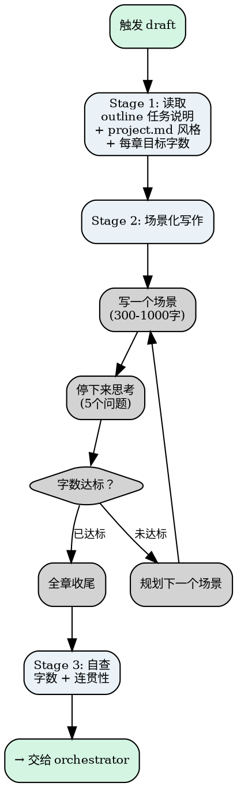

# Novel Draft

写当前章节的正文。不拆 scene card、不写 task card——直接写正文。核心原则：**遵守 project.md 的风格要求，完成 outline 中当前章的任务说明，写完后交给 orchestrator 等待用户确认。**

<HARD-GATE>
**每一章（包括第二章、第三章……第N章）都必须完整执行以下流程，不允许因为"之前读过"而跳过任何一个步骤：**

1. 读取 `outline.md` → 当前章任务说明
2. 读取 `project.md` → 风格/世界观/禁止事项
3. 读取 `styles/[风格名].md` → 句式/对话/情绪/去AI味规则
4. 读取 `templates/guide.md` → **去AI味禁用词表、章末规则、生成期自检**（这是最容易被跳过但最重要的文件）
5. 读取 `人物/` 角色卡 → 角色画像/驱动力/变更记录
6. 读取前一章末尾 500 字 → 衔接

**未完成以上 6 步之前，绝对不允许写任何正文。违反此规则产出的章节将脱离故事计划、违反既定 canon、充满 AI 味。**

Do NOT modify project.md or outline.md under any circumstances — these files are owned by novel-brainstorm and novel-outline respectively.
</HARD-GATE>

## Anti-Pattern: "This Chapter Is Simple Enough To Write Without Reading The Outline"

Every chapter goes through this process. Even if the task description seems obvious, you still need to read the outline task, the surrounding chapters' tasks (for continuity), and the project constraints before writing. Skipping this step produces chapters that drift from the story plan, introduce unintended canon conflicts, or miss structural hooks that the outline carefully placed. The read step takes seconds — skipping it wastes an entire chapter.

## Anti-Pattern: "I Already Read These Files In The Previous Chapter"

**This is the #1 cause of quality degradation in later chapters.** AI tends to skip Stage 1 from chapter 2 onwards, which causes:
- guide.md 的去AI味禁用词表被遗忘 → AI 味回归
- 风格文件的句式/对话/情绪规则被遗忘 → 风格漂移
- 人物卡的变更记录被遗忘 → 角色不一致
- 前一章末尾没读 → 章节衔接断裂

**每一章都必须重新读取所有 6 个文件。没有例外。**

---

## Checklist

You MUST complete these items in order:

1. **Read ALL 6 context files** — 逐一读取以下文件，每读完一个输出 `[✓] 文件名: 一句话摘要`：
   - `[ ] outline.md` — 当前章任务说明 + 前后章任务（确保衔接）
   - `[ ] project.md` — 风格要求 + 禁止事项 + 字数目标 + 世界观规则
   - `[ ] styles/[风格名].md` — 句式规则 + 对话规则 + 情绪规则 + 去AI味规则 + 禁止事项
   - `[ ] templates/guide.md` — 禁用词表 + 章末规则 + 排版禁止 + 生成期自检流程
   - `[ ] 人物/角色卡` — 主角画像 + 驱动力 + 配角信息 + 变更记录
   - `[ ] 前一章末尾 500 字` — 衔接点
   - **6 项全部 `[✓]` 后才能进入下一步。缺失任何一项不允许写正文。**
2. **Write draft** — scene-by-scene writing with thinking pauses, prose to 【书名】/第X卷/chapter-xxx.md
3. **Self-check** — verify word count, task completion, no contradictions
4. **Hand off to orchestrator** — invoke novel-orchestrator after user confirms

---

## Process Flow

**The terminal state is invoking novel-orchestrator.** Do NOT invoke novel-review or any other novel skill directly. The ONLY skill you invoke after draft is novel-orchestrator.

---

## The Process

### Stage 1: 读取上下文

**目标：** 获取写作所需的所有信息。

<HARD-GATE>
每一章都必须完整执行 Stage 1，无论这是第几章。不允许因为"之前读过"而跳过任何一个文件。每读取一个文件后，必须输出该文件的关键信息摘要，证明你确实读取了内容。未完成全部读取之前，不允许进入 Stage 2。

**以下 6 个文件是必读的，缺一不可：**
`outline.md`、`project.md`、`styles/[风格名].md`、`人物/[角色名].md`、`templates/guide.md`、前一章正文（如有）。

特别注意：`templates/guide.md` 包含去AI味禁用词表、章末规则、生成期自检流程等核心约束，**每一章都必须读取**，不能用其他文件替代。
</HARD-GATE>

**必须逐一读取以下文件，每读完一个输出摘要：**

1. **读取 `outline.md`**，输出摘要：
   - 当前章任务说明（一句话）
   - 当前卷目标
   - 前一章任务说明（确保衔接）
   - 后一章任务说明（预留钩子空间）

2. **读取 `project.md`**，输出摘要：
   - 风格要求（叙事风格、语言特点）
   - 禁止事项（不能写什么）
   - 每章字数目标
   - 世界观核心规则

3. **读取风格文件 `styles/[风格名].md`**（如 project.md 未指定风格，默认读取 `styles/冷白描.md`），输出摘要：
   - 句式规则
   - 对话规则
   - 情绪规则
   - 去AI味规则
   - 禁止事项

4. **读取 `templates/guide.md`**（核心约束文件，每一章都必须读取），输出摘要：
   - Scene/Sequel 交替模式
   - 去AI味禁用词表（50+ 禁用词）
   - 章末禁止抒情和总结
   - 生成期自检流程

5. **读取 `人物/` 文件夹中的角色卡**，输出摘要：
   - 主角画像和驱动力
   - 相关配角信息
   - 角色变更记录（如有）

6. 如有前一章正文，**读取前一章末尾 500 字**，输出衔接点。

**验证点：** 上述 6 项全部完成，每项都有摘要输出。缺失任何一项则不允许进入 Stage 2。

---

### Stage 2: 场景化写作

**目标：** 逐场景写草稿，每写完一个场景停下来思考。

**子步骤：**

1. **场景规划**：
   - 基于本章任务说明和结构标记，预估需要几个场景
   - 每个场景用一句话描述核心事件
   - 确保场景之间有节奏变化（不能全是同类型场景）

2. **逐场景写入**（正文写入 `【书名】/第X卷/chapter-xxx.md`）：
   a. 写当前场景正文（每个场景 300-1000 字，特殊情况可超过）
   b. 每 300-500 字执行生成期自检：
      1. **禁用词扫描**：检查最近 300-500 字是否包含 guide.md 第七章禁用词表中的词汇（不禁、缓缓、微微、仿佛、然而等）→ 有则替换或重写
      2. **排版模式检测**：是否存在碎片化分行？省略号是否超过 2 个？是否有连续 3 个以上单词语行？→ 是则合并为正常段落（参照 guide.md 7.4 节）
      3. **AI句式检测**：是否连续 3 个以上"主谓宾"结构？段落长度是否连续 3 段相近？→ 是则打破
      4. **检查重复模式**：相同句式/相同结构/相同情绪词是否连续出现 >3 次
      5. **检查风格禁止项**：是否违反当前风格文件的「去AI味」和「禁止事项」section
      - 违反任一条 → 重写最近 300-500 字段落后再继续
   c. 写完场景后停下来，参照 `templates/guide.md` 回答 5 个问题
   d. 统计当前总字数，判断是否已达到目标（从 project.md 的每章目标读取）
   e. 如未达标 → 规划并写下一个场景（不能注水，必须有意义）
   f. 如已达标 → 进入全章收尾
   g. 重复直到总字数超过目标

3. **全章收尾**：
   - 检查场景间过渡是否自然
   - **章末检查（必须执行）**：参照 `templates/guide.md` 第七章「章末」规则：
     - 最后一段是否为抒情/总结/感慨/预告？→ 是则删掉，用行动或钩子替换
     - 最后一段是否包含"开始了""结束了""转动了""新的"等词？→ 是则删掉
     - 最后一段是否让读者想知道"然后呢"？→ 否则加一个钩子
   - 如果章末违反规则 → 重写最后一段，直到通过检查

**验证点：** 每个场景写完后有思考记录，总字数超过目标。

---

### Stage 3: 最低限度自检

**目标：** 快速检查草稿是否满足最低要求。

检查项：

| 检查项 | 标准 | 不通过处理 |
|--------|------|------------|
| 字数 | 字数不低于目标的 90% | 补充或精简 |
| 任务完成 | outline 中的任务说明已被完成 | 补写缺失内容 |
| 前后矛盾 | 没有明显的前后矛盾 | 修正矛盾 |

**验证点：** 所有检查项通过。

---

### Stage 4: 交给 orchestrator

**目标：** 写完后直接交给总控调度，不等待用户确认。

1. 调用 `novel-orchestrator`，由 orchestrator 决定下一步（review → update → 下一章 draft）
2. 用户可以在 orchestrator 层面随时中断或查看进度

---

## Key Principles

- **直接写正文，不造中间产物** — 不要写 scene card、task card，直接产出章节文件和正文文件
- **遵守 project.md 风格与禁止事项** — 风格要求和禁止事项是硬约束，不是建议
- **字数参考 project.md 目标** — 字数可以超过目标，但不能低于目标的 90%
- **写完直接交给 novel-orchestrator** — draft 的终态是调用 orchestrator，由 orchestrator 自动推进后续流程
- **只产出章节文件和正文文件** — 不修改 project.md 或 outline.md，这两个文件的所有权分别属于 brainstorm 和 outline
- **正文直接写入 【书名】/第X卷/chapter-xxx.md** — 不在章节文件中写正文草稿，正文直接写入按书名和卷组织的独立文件
- **Scene-by-scene, not all-at-once** — 逐场景写作，每写完一个场景停下来思考
- **Think like a writer, not an executor** — 参照 `templates/guide.md`，像作家一样思考下一步
- **Over, never under** — 字数可以超过目标，但不能低于目标的 90%。未达标必须继续写场景
- **Self-correct while writing, not after** — 每 300-500 字执行生成期自检，违反风格规则立即重写，不要等到 review

## Anti-Patterns

| 错误行为 | 正确做法 |
|----------|----------|
| **跳过 Stage 1 直接写正文** | **每一章都必须完整执行 Stage 1，逐一读取并输出摘要** |
| **因为"之前读过"就跳过文件** | **无论第几章，6 个文件必须全部重新读取** |
| **不读 guide.md 就开始写** | **guide.md 是写作的核心约束，必须读取并遵守** |
| **不读风格文件就按自己感觉写** | **风格文件的句式/对话/情绪/去AI味规则必须遵守** |
| **不读人物卡就凭印象写角色** | **人物卡的驱动力/恐惧/变更记录必须遵守** |
| 先写 scene card 再写正文 | 直接写正文 |
| 本章全是铺垫，没有实质性事件 | 确保有推进 |
| 忽略 project.md 的禁止事项 | 严格遵守 |
| 与前一章脱节 | 读取前一章末尾 500 字确保衔接 |
| 一次性写完整章不停下来思考 | 逐场景写作，每场景后思考 |
| 总字数未达标就结束 | 必须继续写场景直到超过目标 |

## Cross-references

### 上游

- **`novel-outline`**：提供章节任务说明。
- **`novel-orchestrator`**：判定当前章待写时激活本 skill。

### 下游

- **`novel-orchestrator`**：草稿完成后经用户确认交给 orchestrator 路由到 review。

### 关键文件

| 文件 | 职责 |
|------|------|
| `project.md` | 输入：风格、世界观、字数要求 |
| `人物/[角色名].md` | 输入：角色画像、驱动力、关系 |
| `outline.md` | 输入：当前章任务说明 |
| `章节/chapter-xxx.md` | 输出：本章目标 + 修改意见 + 定稿摘要 |
| `【书名】/第X卷/chapter-xxx.md` | 输出：纯正文 |

### 参考文档

- **`shared/file-contracts.md`**：章节文件和正文文件的字段规范定义
- **`shared/state-rules.md`**：状态流转规则
