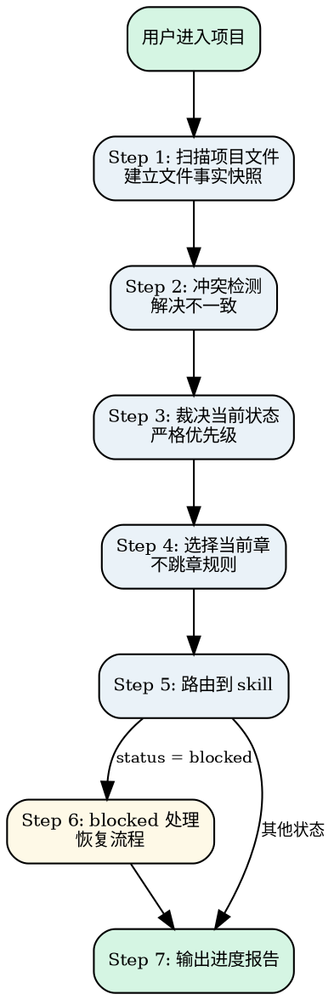

# Novel Orchestrator

极简总控。不写正文、不造设定、不做审查——只做一件事：**读文件、判状态、解决冲突、路由到正确的子 skill**。

整个系统使用 **status + stage** 双层状态模型。status 共 6 个，stage 共 5 个。裁决逻辑严格按优先级执行。

**自动推进模式：** 用户确认一次后，orchestrator 自动推进整个流程（draft → review → update → 下一章 draft），不需要每步都等用户确认。用户随时可以中断、查看进度、或提出修改。

<HARD-GATE>
Do NOT make any routing decision without reading the actual project files first. Do NOT write or generate any artifact that belongs to another skill (no outlines, no drafts, no reviews). Every judgment MUST be based on file-level facts, not on conversation memory or assumptions. Violating this gate will corrupt the entire pipeline.
</HARD-GATE>

## Anti-Pattern: "This System Is Simple Enough To Skip The Orchestrator"

Every novel project goes through this process. Even if the project state seems obvious ("we were just drafting chapter 3"), you still need to scan the files, detect conflicts, and make a formal routing decision. The orchestrator can be fast (a few seconds of file scanning) if the state is clean, but it MUST read the files and follow the priority rules before routing. Skipping this step means you might route to the wrong skill, miss a blocked state, or silently ignore file conflicts that will cascade into downstream errors.

---

## Checklist

You MUST complete these items in order:

1. **Scan project files** — check existence of project.md, outline.md, chapter files, project-state.md; build a file-fact snapshot
2. **Conflict detection** — resolve inconsistencies between frontmatter, outline status, and project-state.md using priority rules
3. **Judge current state** — determine status (6 values) and stage (4 values) based on resolved file facts
4. **Select current chapter** — pick the correct chapter using priority rules, enforce no-skip rule
5. **Route to skill** — output routing decision to the correct sub-skill
6. **Handle blocked** — if blocked_reason is non-empty, follow blocked recovery flow
7. **Progress report** — output natural-language progress report to the user

---

## Process Flow



**The terminal state is routing to the correct sub-skill.** Do NOT write or generate any artifact. The ONLY output of this skill is a routing decision and a progress report.

---

## The Process

### Step 1: 扫描项目文件

**目标：** 建立当前项目的文件事实快照。

1. 检查 `project.md` 是否存在
2. 检查 `outline.md` 是否存在
3. 如果 `outline.md` 存在，读取当前卷的章节列表和各章 status
4. 检查当前章是否有章节文件（`章节/chapter-xxx.md`），读取 frontmatter
5. 读取 `project-state.md`（如存在）获取上次记录的状态
6. 检查 `project-state.md` 中 `blocked_reason` 是否非空

**验证点：** 能够准确列出项目中已存在和缺失的关键文件，以及各章节的 status。

---

### Step 2: 冲突检测与解决

**目标：** 发现并解决不同文件之间的状态不一致。

#### 2a. 裁决优先级（从高到低）

```
唯一真相源原则：
- 章节执行状态 → 以章节 frontmatter 为准（outline 中的状态只是摘要，不是真相源）
- 结构顺序 → 以 outline.md 为准
- 项目设定 → 以 project.md 为准
- project-state.md 只是调度快照，不是真相源

冲突解决：
- frontmatter.status 与 outline 状态冲突 → 以 frontmatter 为准，记录冲突并路由到 `novel-outline` 修复
- project-state.md 与 frontmatter 冲突 → 以 frontmatter 为准，同步更新 project-state.md
```

#### 2b. 异常处理规则

| 冲突场景 | 解决规则 | 理由 |
|----------|---------|------|
| 多章同时 `drafting` | 只处理最早的那章，其他等待 | 单线程推进，防止混乱 |
| `reviewing` 和 `drafting` 状态不一致 | 以 `reviewing` 为准（审查优先） | 审查结果决定是否需要重写 |
| `project-state.md` 和 frontmatter 冲突 | 以 frontmatter 为准（文件级真相） | 章节文件是实际产物 |
| `outline.md` 中章节状态与 frontmatter 冲突 | 以 frontmatter 为准，同步更新 outline | frontmatter 是执行真相 |
| `project-state.md` 中 `blocked_reason` 非空 | 状态强制为 `blocked`，忽略其他判断 | blocked 是最高优先级中断 |

**验证点：** 所有冲突已按规则解决，得到一致的状态视图。

---

### Step 3: 裁决当前状态

**目标：** 根据冲突解决后的文件事实判断项目状态。

裁决逻辑（按优先级）：

| # | 条件 | 判定 status | 判定 stage |
|---|------|------------|-----------|
| 1 | `project-state.md` 中 `blocked_reason` 非空 | `blocked` | 根据原因确定 |
| 2 | 无 `project.md` | `idea` | `brainstorm` |
| 3 | 有 `project.md`，无 `outline.md` 或 outline 中当前卷无章节 | `idea` | `outline` |
| 4 | 有 outline，当前章 status 为 `planned` | `planned` | `draft` |
| 5 | 当前章 frontmatter.status 为 `drafting` | `drafting` | `draft` |
| 6 | 当前章 frontmatter.status 为 `reviewing` | `reviewing` | `review` |
| 7 | 当前章 frontmatter.status 为 `done` | `done` | — |

**验证点：** 裁决结果与上述逻辑一致。

---

### Step 4: 选择当前章

**目标：** 确定应该处理哪一章。

#### 4a. 当前章选择规则

```
当前章 = outline.md 中当前卷里，按以下优先级选择：

1. 优先选 status = reviewing 的（中断恢复，审查优先）
2. 其次选 status = drafting 的（中断恢复，继续写）
3. 其次选 status = planned 的（正常推进，选最早的一章）
4. 如果当前卷所有章都是 done → 触发卷完成，路由到 outline
```

#### 4b. 不跳章规则

```
- 不允许跳章：不能在有 planned 章节时去写后面的章节
- 章节必须按 outline.md 中的顺序依次推进
- 唯一例外：review 判定为「reject」时，可以回到当前章重新规划
```

**验证点：** 当前章选择符合优先级规则，无跳章行为。

---

### Step 5: 路由到对应 skill

**目标：** 输出路由决策。

| 当前 status | 路由目标 | 说明 |
|------------|----------|------|
| `idea` | `novel-brainstorm`（无 project.md） | 从零开始 |
| `idea` | `novel-outline`（有 project.md 无 outline.md） | 规划章节 |
| `planned` | `novel-draft` | 开始写当前章 |
| `drafting` | `novel-draft` | 继续写当前章 |
| `reviewing` | `novel-review` | 审查当前章 |
| `done` | `novel-update` | 推进 |
| `update` | `novel-update` | review 通过后执行同步 |
| `blocked` | 根据阻塞原因路由（见 Step 6） | 恢复流程 |

### project-state.md 更新时机

orchestrator 是 project-state.md 的唯一所有者，在以下时机更新：

| 时机 | 更新字段 |
|------|---------|
| 路由到子 skill 之前 | `last_skill` = 目标 skill 名称，`updated_at` = 当前时间 |
| 子 skill 完成交回后 | `last_skill` = orchestrator，`updated_at` = 当前时间 |
| blocked 处理时 | `blocked_reason` = 具体原因 |
| 章节状态变更时 | `current_chapter` = 最新章节 ID |

其他 skill 不得修改 project-state.md。

---

### Step 6: blocked 的完整处理

#### 6a. blocked 触发条件（任一）

1. review 判定为「reject」（方向性错误）
2. canon 一致性严重冲突（review 发现与 `project.md` 硬规则矛盾）
3. 用户主动声明"停下来"

#### 6b. blocked 恢复流程

```
1. 记录 blocked_reason 到 project-state.md
2. 根据原因路由：
   - 方向错误 → novel-outline（重新规划当前章或当前卷）
   - canon 冲突 → 人工确认后更新 project.md
   - 用户暂停 → 等待用户指令
3. 恢复后清除 blocked_reason，status 回退到 planned
```

#### 6c. blocked 路由表

| blocked 原因 | 路由目标 | 恢复后 status |
|-------------|---------|--------------|
| 方向错误（review reject） | `novel-outline` | `planned` |
| canon 冲突 | 等待人工确认 → 更新 `project.md` | 恢复到 blocked 前的 status |
| 用户暂停 | 等待用户指令 | 恢复到 blocked 前的 status |

---

### Step 7: 输出进度报告

**目标：** 用自然语言告诉用户当前进度和下一步。

格式：

```markdown
## 当前进度

- **项目状态：** [status 名称]
- **当前阶段：** [stage 名称]
- **当前章节：** [第X卷 第Y章 / N/A]
- **已完成：** [已完成章节数 / 当前卷总章节数]
- **下一步：** [即将执行的操作，用自然语言描述]

> 如果你确认当前方向，我将交给 [对应 skill] 继续下一步作业。
```

**关键约束：**
- 不使用技术术语，用用户能理解的自然语言
- 明确告诉用户"现在要做什么"和"为什么"
- 如果用户想跳过某一步，解释为什么不能跳过
- 如果处于 blocked 状态，清楚说明阻塞原因和恢复方案

---

## Key Principles

- **File facts over memory** — 以文件事实为准，不依赖临时上下文记忆。每次裁决必须重新读取文件，不缓存判断
- **Never write for other skills** — 不直接代写任何其他 skill 的产物。orchestrator 只裁决和路由，绝不越权
- **Single-thread progression** — 单线程推进，同时只处理一个章节。多章并行会导致上下文混乱
- **Conflict resolution by priority** — 冲突解决必须遵循本文定义的优先级规则：frontmatter > outline > project-state.md
- **No-skip enforcement** — 不允许跳章，章节必须按 outline.md 中的顺序依次推进
- **Always report progress** — 完成后用自然语言告诉用户当前进度和下一步，让用户保持掌控感

---

## Anti-Patterns

| 错误行为 | 后果 | 正确做法 |
|----------|------|----------|
| 记忆裁决（不读文件就判断） | 状态判断错误 | 每次必须重新读取文件 |
| 越权代写（帮用户写产物） | 产出质量无法保证 | 只裁决和路由 |
| 跳过状态（从 idea 直接跳到 draft） | 缺少必要前置 | 严格按状态机推进 |
| 静默通过（不告诉用户就推进） | 用户失去掌控感 | 每步都输出进度报告 |
| 跳章（在有 planned 章节时写后面的） | 叙事不连贯 | 严格按顺序推进 |
| 忽略冲突（文件状态不一致时不处理） | 后续流程混乱 | 按 2a 优先级解决冲突 |
| 多章并行（同时处理多个 drafting 章节） | 上下文混乱 | 单线程推进 |

---

## Cross-references

### 子 Skill 清单

| Skill | 触发条件 | 产出 |
|-------|----------|------|
| `novel-brainstorm` | status=`idea` 且无 `project.md` | `project.md` + `人物/` 文件夹 |
| `novel-outline` | status=`idea` 且有 `project.md`，或卷完成，或 blocked（方向错误） | `outline.md`（更新） |
| `novel-draft` | status=`planned` 或 `drafting` | `章节/chapter-xxx.md` + `【书名】/第X卷/chapter-xxx.md` |
| `novel-review` | status=`reviewing` | `章节/chapter-xxx.md`（更新） |
| `novel-update` | review 通过后自动触发 | `project.md` 变更日志 + `人物/` 角色卡变更记录 + `outline.md` 状态 + 章节定稿摘要 |

### 关键文件

| 文件 | 职责 | 所有者 |
|------|------|--------|
| `project.md` | 项目设定、风格、世界观 | `novel-brainstorm` |
| `project.md` | 输入：项目设定；输出：变更日志（novel-update 追加） | `novel-update` |
| `人物/[角色名].md` | 角色详细信息、变更记录 | `novel-brainstorm` / `novel-update` |
| `outline.md` | 卷结构和章节路线 | `novel-outline` |
| `章节/chapter-xxx.md` | 章节目标 + 修改意见 + 定稿摘要 | `novel-draft` / `novel-review` |
| `【书名】/第X卷/chapter-xxx.md` | 纯正文定稿 | `novel-draft` / `novel-review` |
| `project-state.md` | 项目状态记录 | `novel-orchestrator` |

### 参考文档

- **`shared/state-rules.md`**：状态定义与流转规则（唯一真相源）
- **`shared/file-contracts.md`**：文件字段规范定义
