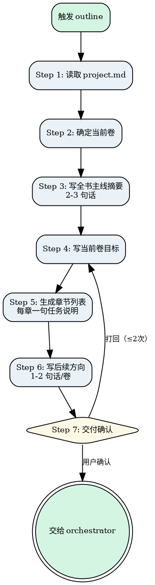

# Novel Outline

把 `project.md` 转成当前卷的可执行章节路线。采用**逐卷渐进规划**：首次规划第 1 卷详细内容 + 后续卷粗略方向；后续基于已写完的卷规划下一卷。

核心原则：**只做结构规划，不写正文。只详细规划当前卷。**

<HARD-GATE>
Do NOT start planning chapters without reading project.md first. Do NOT plan all volumes in detail at once — only the current volume gets detailed chapter plans; subsequent volumes get 1-2 sentence direction seeds. Planning the entire book upfront will produce rigid, disconnected outlines that cannot adapt to what actually gets written.
</HARD-GATE>

## Anti-Pattern: "This Story Is Clear Enough To Plan All Chapters At Once"

Every novel project goes through this process one volume at a time. Even if the user says "I already have the full story mapped out", you still need to plan only the current volume in detail and give subsequent volumes just 1-2 sentence direction seeds. The outline can be fast if the user's vision is clear, but it MUST respect the incremental planning discipline. Planning all chapters upfront means you lock in assumptions before any writing happens, and those assumptions will inevitably conflict with what actually emerges during drafting.

---

## Checklist

You MUST complete these items in order:

1. **Read project.md** — extract core premise, characters, world rules, conflict, writing style, word count targets; for subsequent plans also read completed volumes
2. **Determine current volume** — first time = Volume 1; subsequent = next volume after all chapters done
3. **Write full-story summary** — 2-3 sentences covering the entire book arc (revise based on actual written content for subsequent plans)
4. **Write current volume goal** — specific, actionable goal with clear start/end states
5. **Generate chapter list** — one-sentence task per chapter with structure tags (setup/build/climax/fallout)
6. **Write future directions** — 1-2 sentences per subsequent volume as direction seeds
7. **Deliver and confirm** — save outline.md, show summary to user, get approval, hand off to orchestrator

---

## Process Flow



**The terminal state is invoking novel-orchestrator.** Do NOT invoke novel-draft or any other novel skill directly. The ONLY skill you invoke after outline is novel-orchestrator.

---

## The Process

### Step 1: 读取 project.md

**目标：** 获取项目的核心设定。

1. 读取 `project.md`，提取：
   - 核心 Premise + 角色索引 + 世界观硬规则 + 核心冲突 + 写作风格 + 字数规划
2. 读取 `人物/` 文件夹中的角色卡，提取角色详细信息

**后续规划额外读取：**
- 读取 `outline.md` 中已完成卷的实际内容
- 读取已完成章节的定稿，提取实际发生的情节和角色走向

**验证点：** project.md 存在且内容完整。

---

### Step 2: 确定当前卷

**目标：** 确定本次规划的是哪一卷。

- 首次规划 → 第 1 卷
- 后续规划 → 下一卷（当前卷所有章 done 后触发）
- 如 `outline.md` 已存在，读取当前卷状态

**验证点：** 当前卷编号已明确。

---

### Step 3: 写全书主线摘要

**目标：** 用 2-3 句话概括全书走向。

- 首次规划：基于 project.md 的核心设定和冲突，写出全书主线
- 后续规划：基于已完成卷的实际走向，修正全书主线摘要

**格式：**

```markdown
## 全书主线摘要
[2-3 句话概括全书从哪里开始、经过什么、到哪里结束]
```

**验证点：** 摘要不超过 3 句话，覆盖起承转合。

---

### Step 4: 写当前卷目标

**目标：** 明确当前卷要完成什么。

**格式：**

```markdown
## 当前卷：第 [N] 卷

**卷目标：** [1-2 句话描述本卷要完成什么]
```

**关键约束：**
- 后续规划时，起始状态必须与上一卷实际结束状态一致
- 卷目标必须具体到可执行（不是"主角成长了"，而是"主角从 X 状态变为 Y 状态"）

**验证点：** 卷目标具体、起始/结束状态清晰。

---

### Step 5: 生成当前卷章节列表

**目标：** 产出章节级路线图。

**格式：**

```markdown
### 章节列表

| 章节 | 任务说明 | 结构标记 | 状态 |
|------|---------|---------|------|
| chapter-001 | [一句话任务] | setup | planned |
| chapter-002 | [一句话任务] | build | planned |
| chapter-003 | [一句话任务] | climax | planned |
...
```

**结构标记（4 种，必填）：**

| 标记 | 含义 |
|------|------|
| `setup` | 建立场景、引入角色/冲突 |
| `build` | 推进冲突、升级张力 |
| `climax` | 高潮、关键转折点 |
| `fallout` | 收束、余波、为下一阶段铺垫 |

**卷级约束（强制）：**
- 每卷应包含至少一个 setup、一个 climax、一个 fallout
- setup 在卷的开头部分
- fallout 不连续超过 2 章
- 章节结构标记序列不能全为同一种

**关键约束：**
- 每章**只有一句任务说明**，不要拆成 scene card / task card
- 任务说明要具体到可执行（不是"日常"，而是"主角在集市偶遇神秘商人，获得第一个线索"）
- 章节数量参考 project.md 的字数规划
- 每章必须至少推进一条冲突线或完成一个叙事目标
- 标注结构关键章（转折点、高潮）
- 每章必须填写结构标记，不可留空

- **版本管理**：每次修改 outline.md 的章节内容后，将所有受影响章节的 `source_outline_version` 递增 1（在对应的 `章节/chapter-xxx.md` 的 frontmatter 中）

**验证点：**
- 每章有且只有一句任务说明
- 章节间有清晰的推进关系
- 无填充章节

---

### Step 6: 写后续方向

**目标：** 为后续卷写粗略方向。

**格式：**

```markdown
## 后续方向

### 第 [N+1] 卷
[1-2 句话粗略方向]

### 第 [N+2] 卷
[1-2 句话粗略方向]
```

**关键约束：**
- 每卷不超过 2 句话
- 标注仅为"种子"，后续规划时可能调整
- 后续规划时，根据已完成卷的实际走向调整种子

**验证点：** 后续方向每卷不超过 2 句话。

---

### Step 7: 交付确认

**目标：** 确保产出可以交给 draft skill。

1. 确认 `outline.md` 已保存
2. 向用户展示大纲摘要，询问：
   > "如果你确认当前方向，我将交给总控继续下一步作业。"
3. 用户确认后，调用 `novel-orchestrator` 推进到 `novel-draft`
4. 用户不通过则修改后重新确认，最多打回 2 次

**验证点：** outline.md 存在且用户已确认。

---

## Key Principles

- **Incremental volume planning** — 只详细规划当前卷，后续卷只有 1-2 句话方向。后续规划时基于已写完的卷调整，不凭最初设想
- **One sentence per chapter** — 每章只有一句任务说明，不拆 scene card / task card。任务说明要具体到可执行
- **Structure tags are mandatory** — 每章必须填写结构标记（setup/build/climax/fallout），卷级结构约束必须满足
- **Ground everything in project.md** — 所有规划必须有 project.md 依据，不凭空编造与设定矛盾的情节
- **Adapt to reality, not the original plan** — 后续规划时基于已完成卷的实际走向调整方向，不按原计划硬套
- **Single file output** — 只更新 outline.md 一个文件，不修改 project.md 或其他文件

---

## Anti-Patterns

| 错误行为 | 正确做法 |
|----------|----------|
| 每章写 200 字详细规划 | 每章只有一句任务说明 |
| 一次性规划全书所有章节 | 只详细规划当前卷 |
| 后续卷也写详细章节 | 后续卷只有 1-2 句话方向 |
| 凭空编造与 project.md 矛盾的情节 | 所有规划基于 project.md |
| 后续规划按原计划而非实际内容 | 基于已完成卷的实际走向调整 |

---

## Cross-references

### 上游

- **`novel-brainstorm`**：提供 `project.md` 作为输入。
- **`novel-orchestrator`**：判定需要 outline 时激活本 skill。

### 下游

- **`novel-draft`**：消费 `outline.md` 的章节任务说明来写正文。
- **`novel-review`**：review 通过后回到本 skill 规划下一卷。

### 关键文件

| 文件 | 职责 |
|------|------|
| `project.md` | 输入：项目设定 |
| `人物/[角色名].md` | 输入：角色详细信息 |
| `outline.md` | 输出：卷结构和章节路线 |

### 参考文档

- **`shared/file-contracts.md`**：outline.md 的字段规范定义（唯一真相源）
- **`shared/state-rules.md`**：状态流转规则
