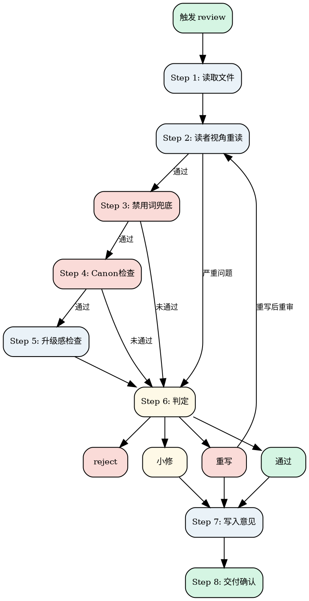

# Novel Review

审查当前章节，决定通过/小修/重写/reject。

**职责边界：guide.md 管"怎么写"，review 管"写得怎么样"。**

review 是唯一的质量闸门。guide.md 定义了写作规则，但 AI 不一定遵守。review 的职责是：
1. **读者视角重读**——以读者身份检查：有没有废话？有没有重复？有没有走神？
2. **禁用词兜底**——guide.md 的禁用词表和排版规则，AI 写的时候可能漏掉
3. **Canon 一致性**——新设定必须记录，冲突必须消除
4. **升级感检查**——和前几章相比，冲突有没有升级、有没有揭示新信息

<HARD-GATE>
Do NOT review without reading: 章节/chapter-xxx.md（目标）+ 正文 + project.md（风格）+ outline.md（任务）。
</HARD-GATE>

---

## Checklist

1. **Read files** — chapter file + prose + project.md + outline.md
2. **Reader perspective** — read as a reader: filler? repetition? boring?
3. **Banned-word scan** — 7.1 禁用词 + 7.4 伪文学腔 + 7.2 句式重复
4. **Canon check** — new settings? conflicts with existing canon?
5. **Escalation check** — conflict escalation vs previous chapters? new info revealed?
6. **Verdict** — pass / minor-fix / rewrite / reject
7. **Write feedback** — write to chapter file, present to user
8. **Delivery** — invoke novel-update after user confirmation

---

## Process Flow



**Terminal state: invoke novel-update → novel-orchestrator.** Do NOT invoke novel-draft directly for the next chapter.

---

## The Process

### Step 1: 读取文件

读取 `章节/chapter-xxx.md`（目标）+ 正文 + `project.md`（风格）+ `人物/` 角色卡 + `outline.md`（任务）。

---

### Step 2: 读者视角重读

**目标：** 以读者身份从头读一遍正文，发现"读起来不对"的问题。

逐段扫描，问自己三个问题：

#### 问题 1：有没有哪段删掉之后，读者不会注意到？

- 不会断、不会漏 → 删掉。这段是废话
- 会断或会漏 → 保留

**什么算"废话"：**
- 帮读者回忆刚刚发生的事（"虽然他付出了XX，但换来了YY"）
- 重复上一章已经建立的信息（同一个设定在三章里解释了三次）
- 没有画面、没有行动、没有新信息的感慨段落

#### 问题 2：有没有哪个句子/段落和前几章重复了？

- 用过 → 换一种。重复 = 偷懒 = 出戏
- 没用过 → 通过

**什么算"重复"：**
- 相同的结尾句式（连续两章用同一句话收尾）
- 相同的事件流程（第三章的冲突和第一章几乎一样）
- 相同的情绪反应（每次遇到冲突都是同样的反应）
- 相同的过渡方式（每次都用同一种方式切入新场景）

#### 问题 3：如果我是读者，读到这里会不会走神？

- 会想跳 → 这段太无聊了
- 不会想跳 → 通过

**什么让读者走神：**
- 连续的日常流程描写（没有意外发生）
- 连续的相似事件（过程几乎一样）
- 没有信息量的对话（没有潜台词或性格展示）
- 没有推进情节也没有建立角色的描写段落

**判定逻辑：**
- 发现少量问题（1-3 处） → 记录，进入 Step 3
- 发现大量问题（4+ 处，或全章平淡无奇） → 🔄 rewrite_required
- 发现致命问题（大段废话、严重重复、完全走神） → ⏪ reject

---

### Step 3: 禁用词兜底

**目标：** 检查 guide.md 定义了但 AI 写的时候可能漏掉的规则。

**检查项：**

1. **禁用词扫描**（参照 guide.md 7.1 禁用词表）：
   - 情绪/心理词（不禁、缓缓、微微、淡淡……）
   - 连接/过渡词（然而、此外、与此同时……）
   - 解释性短语（这意味着、也就是说……）
   - 空洞修饰（仿佛、宛如、好似……）
   - AI 式抒情/总结/反应
   - 发现 → 🔧 小修（替换为具体画面或行动）

2. **伪文学腔检测**（参照 guide.md 7.4）：
   - 碎片化分行 → 🔄 rewrite_required
   - 省略号泛滥（一段话超过 2 个） → 🔧 小修
   - 连续 3 个以上单词语行 → 🔧 小修
   - 全文超过 5% 为碎片化分行 → 🔄 rewrite_required

3. **句式重复检测**（参照 guide.md 7.2）：
   - 相同句式连续 >3 次 → 🔧 小修
   - 相同段落结构连续 >3 次 → 🔧 小修
   - 整章句式单一 → 🔄 rewrite_required

4. **章末检查**（参照 guide.md 第八章）：
   - 最后一段是抒情/总结/感慨/预告 → 🔧 小修
   - 和上一章结尾模式相同 → 🔧 小修

5. **数学/逻辑验算**：
   - 涉及数字的内容（利息、比例、时间换算）有计算错误 → 🔧 小修

**判定逻辑：**
- 任一触发 rewrite → 直接 🔄 rewrite_required，跳过 Step 4-5
- 任一触发小修 → 记录问题，继续 Step 4（小修问题累积到判定时一起处理）
- 全部通过 → 进入 Step 4

---

### Step 4: Canon 检查

**目标：** 确保 draft 没有引入未记录的设定，没有与已有设定冲突。

**检查项：**

1. **新增设定：** 是否引入了 project.md 中未记录的重要新设定？
   - 是 → 🔧 小修（必须在 project.md 中追加记录后再通过）

2. **Canon 冲突：** 是否与 project.md 或角色卡中已确认的事实矛盾？
   - 致命冲突（核心规则矛盾） → ⏪ reject
   - 轻微不一致（细节偏差） → 🔧 小修

3. **任务完成度：** 本章是否完成了 outline 中的任务说明？
   - 完全没做 → ⏪ reject
   - 做了一半 → 🔧 小修

4. **禁止事项：** 是否违反 project.md 中的禁止事项？
   - 违反 → ⏪ reject

**判定逻辑：**
- 任一触发 reject → 直接 ⏪ reject，跳过 Step 5
- 全部通过 → 进入 Step 5

---

### Step 5: 升级感检查

**目标：** 确保本章不是"正确但无聊"的流水账，和前几章相比有推进感。

**检查项：**

1. **冲突升级：** 冲突烈度是否比前一章高或至少持平？
   - 连续 3 章降级 → ⏪ reject（outline 规划有问题）

2. **信息揭示：** 本章是否揭示了至少一个新信息（新事实、新线索、新侧面）？
   - 连续 2 章只推进情节不揭示新信息 → 🔧 小修

3. **主角处境：** 主角处境是否比前一章更复杂？
   - 原地踏步 → 🔧 小修

**判定规则：**
- 1 项不通过 → 🔧 小修
- 2 项及以上不通过 → 🔄 rewrite_required

---

### Step 6: 判定

汇总 Step 2-5 的所有问题，给出最终判定。

#### 通过

所有检查通过，无重大问题。

#### 小修

整体方向正确，指出最值得改的 **3 处**：
- **问题：** [具体位置]
- **建议：** [修改方向]

小修只改 1 轮，改完直接通过。

#### 重写

核心问题太大，指出核心问题（1-2 个）+ 重写方向。重写后从 Step 2 重新审查，最多 1 次。

#### Reject

方向性错误，建议调整 outline 任务说明，回退到 `novel-outline`。

---

### Step 7: 写入意见

在 `章节/chapter-xxx.md` 中更新「修改意见」section：

```markdown
## 修改意见

**review_status:** pass / minor_fix / rewrite_required / reject
**review_severity:** minor / structural

### 判定依据
1. [具体问题]

### 建议修改
1. [具体修改建议]
```

通过时标记 status = done，向用户展示结果，**等待用户确认**。

---

### Step 8: 交付确认

用户确认后：
1. 调用 `novel-update` 执行 canon 同步
2. update 完成后调用 `novel-orchestrator` 推进到下一章

用户提出修改：
- 小修改 → 直接改，不重新 review
- 大修改 → 重新审查

---

## Key Principles

- **guide.md 管"怎么写"，review 管"写得怎么样"** — review 是唯一的质量闸门
- **读者视角优先** — 先以读者身份感受，再对照规则检查
- **Canon 是底线** — 新设定必须记录，冲突必须消除
- **升级感是质量线** — 不能原地踏步，不能连续降级
- **小修 1 轮，重写 1 次** — 不无限循环
- **用户确认闸门** — 每章通过后必须用户确认，防止错误无声扩散

## Anti-Patterns

| 错误行为 | 正确做法 |
|----------|----------|
| 跳过读者视角重读直接查规则 | 先"感受"再"检查" |
| 小修要求改 5 处以上 | 只指出最值得改的 3 处 |
| 小修后要求改第 2 轮 | 小修只改 1 轮 |
| 重写 2 次还不通过还不回退 | 最多 1 次，不行就回退 |

## Cross-references

### 上游
- **`novel-draft`**：草稿完成后触发
- **`novel-orchestrator`**：判定当前章待审时激活

### 下游
- **`novel-draft`**：小修/重写后回到 draft
- **`novel-outline`**：reject 时回到 outline
- **`novel-update`**：通过后执行 canon 同步
- **`novel-orchestrator`**：通过后推进到下一章

### 关键文件

| 文件 | 职责 |
|------|------|
| `章节/chapter-xxx.md` | 输入：目标；输出：修改意见 + 状态 |
| `【书名】/第X卷/chapter-xxx.md` | 输入：正文 |
| `project.md` | 输入：风格 + Canon |
| `outline.md` | 输入：任务说明 |

### 参考文档

- **`shared/file-contracts.md`**：修改意见格式规范
- **`shared/state-rules.md`**：状态流转规则
- **`skills/novel-draft/templates/guide.md`**：禁用词表（7.1）、排版规则（7.4）、句式规则（7.2）、章末规则（第八章）
