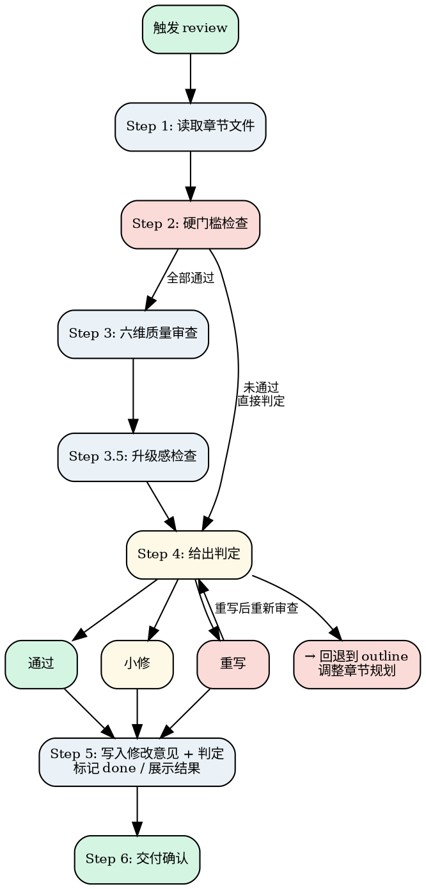

# Novel Review

审查当前章节，决定通过/小修/重写/reject。不是审计员，是创作伙伴——只问 6 个质量问题，给出具体修改建议。核心原则：**审创作质量，不审流程合规。修改意见要具体到"改哪三处最值"。**

<HARD-GATE>
Do NOT review a chapter without reading the full draft from 章节/chapter-xxx.md AND the task description from outline.md AND the style constraints from project.md. Do NOT skip the hard-gate check (Step 2) and jump directly to the six-dimension quality review (Step 3). The hard gate catches fatal issues — canon conflicts, missing tasks, prohibited content — that make quality review meaningless. Violating either gate wastes the review round and risks letting broken content through.
</HARD-GATE>

## Anti-Pattern: "This Chapter Is Good Enough To Skip Review"

Every chapter goes through this process. Even if the draft looks solid on first read, you still need to run all three layers — hard gate, six-dimension review, and escalation check. Skipping review because "it's fine" is how subtle canon drift, flat escalation, and boring-but-correct chapters accumulate across a novel. The review exists to catch problems that the author (even an AI author) is blind to in their own work. A chapter that truly passes all checks will pass quickly — skipping the checks doesn't save time, it saves bad chapters.

---

## Checklist

You MUST complete these items in order:

1. **Read chapter files** — read 章节/chapter-xxx.md (objective) + 【书名】/第X卷/chapter-xxx.md (prose) + project.md (style) + outline.md (task)
2. **Hard-gate check** — verify task completion, prohibited content, canon consistency, new settings, ending quality
3. **Six-dimension review** — evaluate event progression, protagonist change, memorable moment, pacing, emotional arc, chapter-end hook
4. **Escalation check** — compare with previous chapter for conflict escalation and information reveal
5. **Issue verdict** — determine pass / minor-fix / rewrite / rollback based on all checks
6. **Write feedback + finalize** — write review opinion to chapter file, mark done if passed, present result to user
7. **Delivery confirmation** — invoke novel-update after user confirmation, handle post-delivery modifications

---

## Process Flow



**The terminal state is invoking novel-update (which then invokes novel-orchestrator).** Do NOT invoke novel-draft directly for the next chapter — always route through novel-update and then novel-orchestrator after review is complete. The ONLY skills you invoke from review are novel-draft (for minor-fix/rewrite of the current chapter) and novel-update (after pass).

---

## The Process

### Step 1: 读取章节文件

**目标：** 获取审查所需的所有信息。

1. 读取 `章节/chapter-xxx.md`，提取：
   - 本章目标（从 outline 继承的任务说明 + 结构标记）
2. 读取 `【书名】/第X卷/chapter-xxx.md`，提取正文
3. 读取 `project.md`，提取风格要求和禁止事项
4. 读取 `人物/` 文件夹中的角色卡，提取角色信息
5. 读取 `outline.md`，提取当前章任务说明和上下文

**验证点：** 草稿、任务说明、风格要求已获取。

---

### Step 2: 硬门槛检查（先于六维审查）

**目标：** 在进入六维创作质量审查之前，先检查基本合规性。以下任一条件不满足则直接判定，不走六维。

**检查项：**

1. **任务完成度：** 本章是否完成了 outline 中的任务说明？
   - 完全没做 → ⏪ reject
   - 做了一半 → 🔧 小修（必须补完）

2. **禁止事项：** 是否违反 project.md 中的禁止事项？
   - 违反 → ⏪ reject（必须重写去除违规内容）

3. **Canon 一致性：** 是否与 project.md 已确认事实冲突？
   - 致命冲突（核心规则矛盾） → ⏪ reject
   - 轻微不一致（细节偏差） → 🔧 小修

4. **新增设定：** 是否引入了 project.md 中未记录的重要新设定？
   - 是 → 🔧 小修（必须在 project.md 中追加记录后再通过）

5. **结尾质量：** 是否在结尾强行总结/煽情/预告式收尾？
   - 检查最后一段是否为抒情、总结、感慨或预告（如"开始了""结束了""转动了""新的"等词）
   - 是 → 🔧 小修（必须改写为行动式或钩子式结尾，参照 guide.md 第十章）

6. **句式重复检测：** 是否存在 AI 写作典型的句式重复？
   - 相同句式连续出现 >3 次（如连续 3 个"他XXX。她XXX。"） → 🔧 小修
   - 相同段落结构连续出现 >3 次 → 🔧 小修
   - 相同情绪词/形容词重复出现 >3 次 → 🔧 小修
   - 整章句式单一、缺乏变化 → 🔄 rewrite_required

7. **伪文学腔检测：** 是否存在 AI 典型的"伪文学腔"排版？
   - 碎片化分行（一句话拆成 5 行以上） → 🔄 rewrite_required
   - 省略号泛滥（一段话超过 2 个省略号） → 🔧 小修
   - 连续 3 个以上单词语行 → 🔧 小修
   - 全文超过 5% 的内容为碎片化分行/单词语行 → 🔄 rewrite_required

**判定逻辑：**
- 任一检查项触发 reject → 直接判定 ⏪ reject，写入修改意见，跳过六维审查
- 任一检查项触发小修 → 直接判定 🔧 小修，写入修改意见，跳过六维审查
- 全部通过 → 进入 Step 3 六维创作质量审查

**句式重复升级规则：**
- 句式重复 >3 次且为首次（review_round == 0） → minor_fix
- 句式重复 >3 次且为二次（review_round >= 1） → rewrite_required
- 违反风格禁止项 → rewrite_required

**验证点：** 硬门槛全部通过后才进入六维审查。

---

### Step 3: 六维质量审查

**目标：** 从 6 个维度评估创作质量。

<HARD-GATE>
六维审查不是"差不多就算通过"。每个维度都有明确的通过标准，**不满足标准就必须标记为问题**。6 个维度中如果有 2 个以上标记为"问题"，直接判定 rewrite_required。不要因为"整体还行"就放过具体问题。
</HARD-GATE>

#### 维度 1: 事件推进

> 这一章有没有真正发生事情？（不是解释，不是铺垫，而是有推进）

**通过标准：** 本章至少有 1 个明确的事件发生（冲突、发现、决定、转折），且事件与 outline 任务说明相关。
- 通过 → 事件清晰，有推进
- 问题 → 只有铺垫和解释，没有实质事件
- 问题 → 事件与任务说明无关

#### 维度 2: 主角变化

> 主角这一章有没有可感知变化？（哪怕很小）

**通过标准：** 主角在本章结束时与开头相比，至少有一个可感知的变化（新信息、新态度、新关系、新能力、新困境）。
- 通过 → 变化可感知
- 问题 → 主角从头到尾没有变化
- 问题 → 变化太小无法感知（"他知道了某件事"但这件事对后续没有影响）

#### 维度 3: 强记忆点

> 有没有至少一个强记忆点？（对白/动作/反转/场面）

**通过标准：** 本章至少有 1 个让读者印象深刻的瞬间——一句出彩的对话、一个意外的动作、一个反转、一个有冲击力的场面。
- 通过 → 有至少 1 个强记忆点
- 问题 → 全章平淡无奇，没有记忆点
- 问题 → 有潜力但没写到位（指出具体位置）

#### 维度 4: 节奏检查

> 节奏有没有明显发闷的段落？（指出具体段落）

**通过标准：** 全章没有连续 500 字以上的节奏拖沓段落。
- 通过 → 节奏有变化，无发闷段落
- 问题 → 存在节奏拖沓的段落（必须指出具体位置，如"第 3 段到第 5 段"）
- 问题 → 全章节奏均匀但平淡（没有快慢交替）

#### 维度 5: 情绪线

> 情绪线是不是在上升、转折、坠落，还是一直平？

**通过标准：** 本章情绪有至少 1 次明显的起伏（上升→坠落、平静→紧张、紧张→释放等）。
- 通过 → 情绪有起伏变化
- 问题 → 全章情绪平坦（没有起伏）
- 问题 → 情绪变化生硬不自然（缺乏铺垫）

#### 维度 6: 章末钩子

> 结尾有没有推动读者进入下一章？（钩子）

**通过标准：** 最后一段留下悬念、疑问、紧迫感或意外，让读者想知道"然后呢"。
- 通过 → 结尾有钩子
- 问题 → 结尾平淡收束
- 问题 → 有钩子但力度不够

**六维汇总规则：**
- 6 个维度全部"通过" → 进入 Step 3.5 升级感检查
- 1 个维度"问题" → 标记为 🔧 小修
- **2 个及以上维度"问题" → 直接判定 🔄 rewrite_required**
- **3 个及以上维度"问题" → 直接判定 ⏪ reject**

---

### Step 3.5: 升级感检查（防平庸）

**目标**：确保本章不是"正确但无聊"的流水账。

**检查项：**

1. 与前一章的对比：
   - 冲突烈度是否比前一章高或至少持平？（不能连续 3 章降级）
   - 主角处境是否比前一章更复杂？（不能原地踏步）

2. 信息揭示节奏：
   - 本章是否揭示了至少一个新信息（新事实、新线索、新侧面）？
   - 不能连续 2 章只推进情节不揭示新信息

3. 段落级检查：
   - 是否有连续 3 段以上的纯叙述/纯对话/纯描写？（必须交替）
   - 是否有超过 200 字的段落？（建议拆分）

**判定规则：**
- 升级感轻微不足（1 项不通过）→ 🔧 小修
- **升级感严重不足（2 项及以上不通过）→ 🔄 rewrite_required**
- **连续 3 章冲突降级 → ⏪ reject**（说明 outline 规划有问题，需要重新规划）

如果升级感不足，在修改意见中明确指出：
> "本章整体合格，但和前几章相比冲突没有升级。建议在第 X 段增加一个意外转折。"

---

### Step 4: 给出判定

**目标：** 基于六维审查和升级感检查给出判定。

#### 通过

所有维度基本通过，无重大问题。

**操作：** 标记 done，进入 Step 5。

#### 小修

整体方向正确，但有 2-3 处值得改进的地方。

**操作：**
1. 指出最值得改的 **3 处**，格式：
   - **问题：** [具体描述问题在哪]
   - **为什么不好：** [简要说明影响]
   - **建议：** [具体修改方向]
2. draft 根据修改意见修改
3. 改完后直接通过，不再审查第二轮

#### 重写

核心问题太大，部分段落需要重写。

**操作：**
1. 指出核心问题（1-2 个）
2. 说明哪些段落需要重写
3. 给出重写方向
4. 重写后重新审查（最多 1 次，还不行就回退）

#### Reject

方向性错误，当前章节规划本身有问题。

**操作：**
1. 说明为什么方向错了
2. 建议如何调整 outline 中的任务说明
3. 回退到 `novel-outline` 调整章节规划

---

### Step 5: 写入修改意见 + 判定

**目标：** 将审查结果写入章节文件，给出最终判定。

在 `章节/chapter-xxx.md` 中添加/更新「修改意见」section：

```markdown
## 修改意见

**review_status:** pass / minor_fix / rewrite_required / reject
**review_severity:** minor / structural

### 判定依据
1. [具体问题]
2. ...

### 建议修改
1. [具体修改建议]
2. ...

### 六维审查结果
1. 事件推进：[通过 / 问题]
2. 主角变化：[通过 / 问题]
3. 强记忆点：[通过 / 问题]
4. 节奏检查：[通过 / 问题，具体段落：...]
5. 情绪线：[通过 / 问题]
6. 章末钩子：[通过 / 问题]
```

**通过时执行：**

1. 在 `章节/chapter-xxx.md` 中标记 status = done
2. 向用户展示审查结果：
   > "本章已通过审查（通过）。你可以打开章节文件查看修改意见。确认无误后，我将更新设定并进入下一章。"
3. **等待用户确认后再调用 `novel-update`**

**验证点：** 修改意见已写入章节文件，判定已给出，等待用户确认。

---

### Step 6: 交付确认

**等待用户确认后执行：**

1. 调用 `novel-update` 执行 canon 同步、状态更新和定稿摘要
2. update 完成后，调用 `novel-orchestrator` 推进到下一章

如果用户提出修改：
- 小修改 → 直接修改定稿，不重新走 review
- 大修改 → 标记 status = reviewing，重新审查

这个确认点确保：
- 错误不会在用户没注意时扩散到后续章节
- 用户对每章产出有感知

---

## Key Principles

- **三层闸门，层层递进** — 硬门槛（合规+一致性）→ 六维创作质量 → 升级感检查，三层全部通过才算通过
- **修改意见要具体到"改哪三处最值"** — 指出问题在哪、为什么不好、改哪三处最值，不要长篇大论
- **小修只改 1 轮，重写最多 1 次** — 小修改完直接通过，重写还不行就回退到 outline，不无限循环
- **审创作质量，不审流程合规** — 只问 6 个质量问题，不做流程审计
- **修改意见格式严格遵循 file-contracts.md** — 不得自行发明格式，所有字段按规范填写
- **交付确认确保用户感知** — 每章通过后向用户展示结果，小修改直接改、大修改重新审查
- **Structural verdict, not vague feedback** — 判定必须是结构化的（review_status + review_severity），不能是模糊的"写得不错/有问题"

## Anti-Patterns

| 错误行为 | 正确做法 |
|----------|----------|
| 像审计员一样长篇大论 | 简洁具体，只说关键问题 |
| 审流程合规而非创作质量 | 只审 6 个创作质量维度 |
| 小修要求改 5 处以上 | 只指出最值得改的 3 处 |
| 小修后要求改第 2 轮 | 小修只改 1 轮，直接通过 |
| 重写 2 次还不通过还不回退 | 重写最多 1 次，不行就回退 |
| 修改意见格式不规范 | 严格按照 file-contracts.md 定义的格式填写 |

## Cross-references

### 上游

- **`novel-draft`**：草稿完成后经用户确认触发本 skill。
- **`novel-orchestrator`**：判定当前章待审时激活本 skill。

### 下游

- **`novel-draft`**：小修/重写后回到 draft 执行修改。
- **`novel-outline`**：回退时回到 outline 调整规划。
- **`novel-update`**：通过后交给 update 执行 canon 同步、状态更新和定稿摘要。
- **`novel-orchestrator`**：通过后交给 orchestrator 推进到下一章。

### 关键文件

| 文件 | 职责 |
|------|------|
| `章节/chapter-xxx.md` | 输入：本章目标；输出：修改意见 + 定稿摘要 + 状态 |
| `【书名】/第X卷/chapter-xxx.md` | 输入：正文；输出：纯正文定稿（如小修后更新） |
| `project.md` | 输入：风格要求 |
| `人物/[角色名].md` | 输入：角色信息 |
| `outline.md` | 输入：任务说明；回退时由 outline skill 更新 |

### 参考文档

- **`shared/file-contracts.md`**：修改意见格式规范（唯一真相源）
- **`shared/state-rules.md`**：状态流转规则
