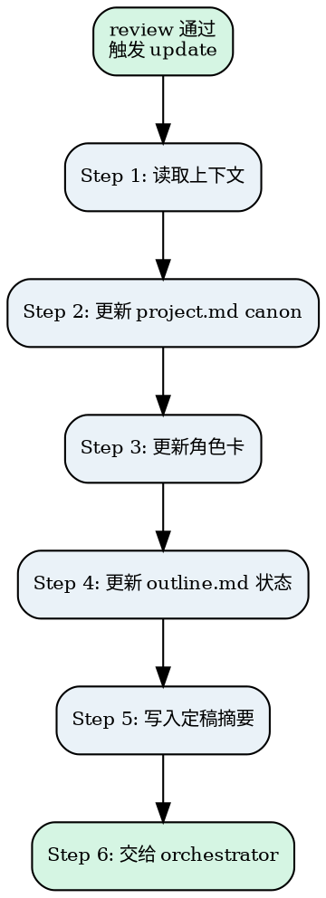

# Novel Update

review 通过后的收尾工作。不做审查，只做同步——把章节产出中的事实变化反映到 project.md、outline.md 和角色卡中。

<HARD-GATE>
Do NOT invoke this skill unless novel-review has explicitly judged the chapter as "pass" (通过). Do NOT make any creative judgment — this skill only synchronizes facts from the chapter output into project.md and outline.md. Violating this gate means either updating canon for unapproved content or making creative decisions outside the review process.
</HARD-GATE>

## Anti-Pattern: "This Chapter Doesn't Need Canon Update"

Every chapter goes through this process after review passes. Even if the chapter introduced no new settings, no new characters, and no world-building changes, you still need to execute the full update flow — at minimum, update the outline status to done and write the chapter summary. Skipping the update because "nothing changed" is how outline statuses fall out of sync and chapter summaries go missing, making it impossible to track project progress later. A chapter with no canon changes will complete this process quickly — skipping it doesn't save time, it creates data gaps.

---

## Checklist

You MUST complete these items in order:

1. **Read chapter files** — read 【书名】/第X卷/chapter-xxx.md (prose) + 章节/chapter-xxx.md (objective) + project.md + outline.md + 人物/ 文件夹中的角色卡
2. **Update project.md canon** — check for setting changes, append to changelog if any
3. **Update character cards** — check for character state changes, append to character card changelog if any
4. **Update outline.md status** — change current chapter status to done
5. **Write chapter summary** — write finalized summary (2-3 sentences) to chapter file
6. **Hand off to orchestrator** — invoke novel-orchestrator to advance to next chapter

---

## Process Flow

**The terminal state is invoking novel-orchestrator.** Do NOT invoke novel-draft directly for the next chapter — always route through novel-orchestrator after the update is complete.

---

## The Process

### Step 1: 读取上下文

**目标：** 获取更新所需的所有信息。

1. 读取 `【书名】/第X卷/chapter-xxx.md`（正文）
2. 读取 `章节/chapter-xxx.md`（目标 + 结构标记）
3. 读取 `project.md`（当前设定）
4. 读取 `outline.md`（当前卷章节列表）
5. 读取 `人物/` 文件夹中的角色卡（当前角色状态）

**验证点：** 正文、章节文件、project.md、outline.md、角色卡已获取。

---

### Step 2: 更新 project.md canon

**目标：** 检查正文是否有设定变更，如有则记录。

扫描正文，检查是否有以下变更：
- 新角色正式登场
- 新地点/组织/物品首次出现
- 主角能力/状态变化
- 世界规则被揭示或修正

**操作：**
- 如有变更 → 追加到 project.md 的「变更日志」section
- 如无变更 → 跳过

**禁止：** 不修改 project.md 的初始设定 section。

**验证点：** 变更日志已更新（如有变更），初始设定未被修改。

---

### Step 3: 更新角色卡

**目标：** 检查正文是否有角色状态变化，如有则记录到对应角色卡。

扫描正文，检查是否有以下角色相关变更：
- 新角色正式登场（如无对应角色卡，则创建新角色卡）
- 角色关系变化（如敌友关系转变、新联盟等）
- 角色能力/状态变化（如获得新能力、受伤、心态转变等）

**操作：**
- 如有变更 → 追加到对应 `人物/[角色名].md` 的「变更记录」section
- 新角色登场 → 在 `project.md` 的「变更日志」中记录"新角色：[角色名]，待创建角色卡"，由用户确认后通过 orchestrator 路由到 novel-brainstorm 创建
- 如无变更 → 跳过

**禁止：** 不修改角色卡的初始设定 section。

**验证点：** 角色卡变更记录已更新（如有变更），初始设定未被修改。

---

### Step 4: 更新 outline.md 状态

**目标：** 将当前章状态标记为完成。

1. 将当前章的状态从 reviewing/done 改为 done（如尚未更新）
2. 检查当前卷是否所有章都是 done
   - 是 → 在 outline.md 中标注"当前卷已完成"

**验证点：** 当前章状态为 done，卷完成状态已标注（如适用）。

---

### Step 5: 写入定稿摘要

**目标：** 在章节文件中记录本章定稿摘要。

在 `章节/chapter-xxx.md` 的「定稿摘要」section 写入 2-3 句话摘要。

摘要内容：
- 本章关键事件
- 角色状态变化
- 引入的新元素

不含正文。

**验证点：** 定稿摘要已写入章节文件。

---

### Step 6: 交给 orchestrator

**目标：** 将控制权交回 orchestrator 推进到下一章。

调用 `novel-orchestrator` 推进到下一章。

**验证点：** orchestrator 已被调用。

---

## Key Principles

- **Read-only on initial settings** — 只追加变更日志，不修改 project.md 和角色卡的初始设定 section
- **Minimal and factual** — 变更日志只记录事实，不做评价
- **Always update status** — 即使没有 canon 变更，也要更新 outline 状态和定稿摘要
- **No creative judgment** — 不做任何创作判断，只做同步

## Anti-Patterns

| 错误行为 | 正确做法 |
|----------|----------|
| 修改 project.md 初始设定 | 只追加变更日志 |
| 修改角色卡初始设定 | 只追加变更记录 |
| 跳过更新因为"没有变化" | 至少更新状态和摘要 |
| 在变更日志中写评价 | 只记录事实 |
| 不更新 outline 状态 | 每次都更新 |

## Cross-references

### 上游

- **`novel-review`**：review 判定为"通过"后触发本 skill。
- **`novel-orchestrator`**：路由到本 skill 执行更新。

### 下游

- **`novel-orchestrator`**：更新完成后交给 orchestrator 推进到下一章。

### 关键文件

| 文件 | 职责 |
|------|------|
| `章节/chapter-xxx.md` | 输入：本章目标；输出：定稿摘要 + 状态更新 |
| `【书名】/第X卷/chapter-xxx.md` | 输入：正文（扫描设定变更） |
| `project.md` | 输入：当前设定；输出：变更日志追加 |
| `人物/[角色名].md` | 输入：当前角色状态；输出：变更记录追加（如有变更） |
| `outline.md` | 输入：当前卷章节列表；输出：状态更新 + 卷完成标注 |
